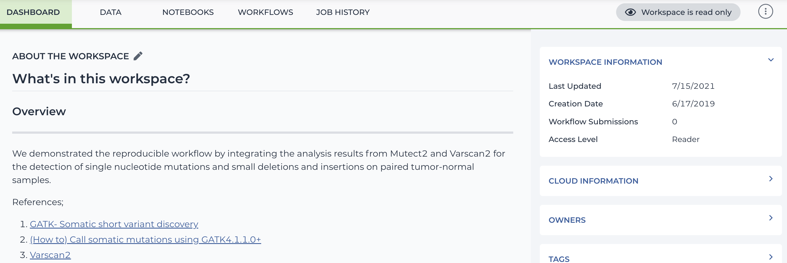

# Terra.bio

## Table of Content

- [Terra.bio](#terrabio)
  - [Table of Content](#table-of-content)
  - [Summary](#summary)
    - [info](#info)
    - [Key Features](#key-features)
    - [Negative points](#negative-points)
  - [overview](#overview)
    - [general](#general)
    - [analysis](#analysis)
    - [data](#data)
    - [workspace](#workspace)
    - [galaxy](#galaxy)
    - [SSO](#sso)
    - [Pricing](#pricing)

## Summary

### info

- [https://terra.bio/](https://terra.bio/)
- from the Broad Institute
- collaboration with Microsoft and Verily

### Key Features

- very similar to GenAP
- built on top of google cloud
- lots of public/private data from institutions
- lots of [analysis](analysis) tool/pipeline options
- federated data echosystem(like candig)
- customizable [workspace](#workspace)

### Negative points

- galaxy is barebone
- thin wrapper over google cloud
- data is a google cloud volume you manage yourself
- pay google cloud for ressources, nothing is free
- users cannot share publicly without approval from the terra team

## overview

### general

- import datasets from institutions, public and access controled
- combine with your own
- run [analysis](#analysis)

### analysis

- wdl pipelines (used by GA4GH)
  - [dockstore](https://dockstore.org)
- jupyter
- Rstudio
- galaxy

### data

- can only be made public with approval from the terra team
- can be shared with other members
- pay for usage
- some data require authorisation
- can create groups and give permissions
- "transfer" is only metadata
- everything is remote (google cloud)
- data banks to mix with your own data
  - 1000 genomes
  - Encode
  - Human Cell Atlas
  - etc

### workspace

- customize dashboard (1 page editable)
- multiple sections
  - Dashboard
  - Data
  - Notebooks
  - Workflows
  - Job history
- shareable
  - can be viewed or cloned

### galaxy

- fixed instance with set cpu/memory
- jobs run locally
- Tools are self-installed

### SSO

- google account

### Pricing

- google billing account, pay for your resources